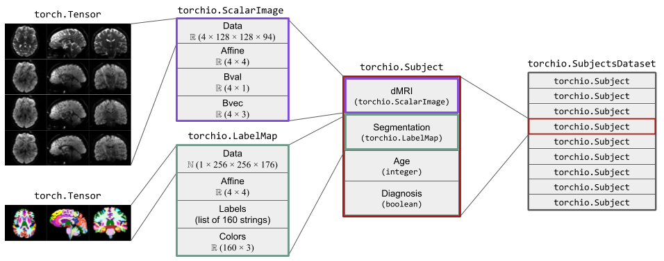

#####
Image
#####

.. currentmodule:: torchio

The :class:`Image` class, representing one medical image,
stores a 4D tensor, whose voxels encode, e.g., signal intensity or segmentation
labels, and the corresponding affine transform,
typically a rigid (Euclidean) transform, to convert
voxel indices to world coordinates in mm.
Arbitrary fields such as acquisition parameters may also be stored.

Subclasses are used to indicate specific types of images,
such as :class:`ScalarImage` and :class:`LabelMap`,
which are used to store, e.g., CT scans and segmentations, respectively.

An instance of :class:`Image` can be created using a filepath, a PyTorch tensor,
or a NumPy array.
This class uses lazy loading, i.e., the data is not loaded from disk at
instantiation time.
Instead, the data is only loaded when needed for an operation
(e.g., if a transform is applied to the image).

The figure below shows two instances of :class:`Image`.
The instance of :class:`ScalarImage` contains a 4D tensor representing a
diffusion MRI, which contains four 3D volumes (one per gradient direction),
and the associated affine matrix.
Additionally, it stores the strength and direction for each of the four
gradients.
The instance of :class:`LabelMap` contains a brain parcellation of the same
subject, the associated affine matrix, and the name and color of each brain
structure.

.. autoclass:: ScalarImage
    :show-inheritance:

.. autoclass:: LabelMap
    :show-inheritance:

.. autoclass:: Image
    :members:
    :show-inheritance:
