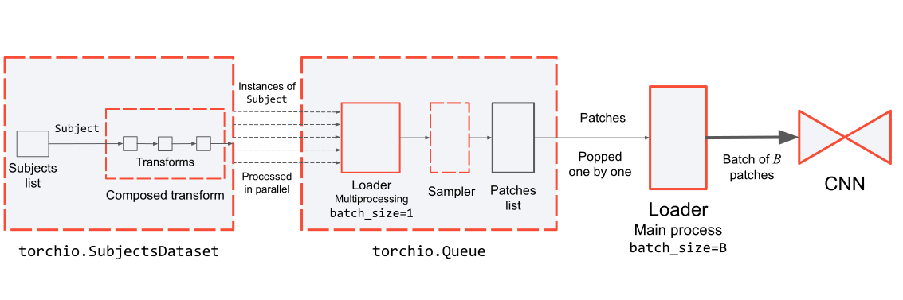

#####################
Patch-based pipelines
#####################

The number of pixels in 2D images used in deep learning
is rarely larger than one million.
For example, the input size of several popular image classification
models is 224 :math:`\times` 224 :math:`\times` 3 = 150 528 pixels
(588 KiB if 32 bits per pixel are used).
In contrast, 3D medical images often contain hundreds of
millions of voxels, and downsampling might not be acceptable when small details
should be preserved.
For example, the size of a high-resolution lung CT-scan used for quantifying
chronic obstructive pulmonary disease damage in a research setting,
with spacing 0.66 :math:`\times` 0.66 :math:`\times` 0.30 mm,
is 512 :math:`\times` 512 :math:`\times` 1069 = 280 231 936 voxels
(1.04 GiB if 32 bits per voxel are used).

In computer vision applications, images used for training are grouped in
batches whose size is often in the order of
hundreds
or even thousands of training instances,
depending on the available GPU memory.
In medical image applications, batches rarely contain more than one or two
training instances due to their larger memory footprint compared to natural
images.
This reduces the utility of techniques
such as batch normalization,
which rely on batches being large enough to estimate
dataset variance appropriately.
Moreover, large image size and small batches result in longer training time,
hindering the experimental cycle that is necessary for hyperparameter
optimization.
In cases where GPU memory is limited and the network architecture is
large, it is possible that not even the entirety of a single volume can be
processed during a single training iteration.
To overcome this challenge, it is common in medical imaging to train using
subsets of the image, or image *patches*,
randomly extracted from the volumes.

Networks can be trained with 2D slices extracted from 3D volumes,
aggregating the inference results to generate a 3D volume.
This can be seen as a specific case of patch-based training,
where the size of the patches along a dimension is one.
Other methods extract volumetric patches for training,
that are often cubes,
if the voxel spacing is isotropic,
or cuboids adapted to the
anisotropic spacing of the training images.

.. toctree::
   :maxdepth: 3

   patch_training.rst
   patch_inference.rst
