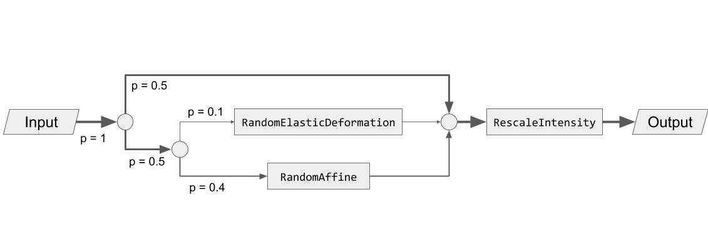

Transforms
----------

TorchIO transforms take as input instances of
:class:`~torchio.Subject` or
:class:`~torchio.Image` (and its subclasses), 4D PyTorch tensors,
4D NumPy arrays, SimpleITK images, NiBabel images, or Python dictionaries
(see :class:`~torchio.transforms.Transform`).

For example::

    >>> import torch
    >>> import numpy as np
    >>> import torchio as tio
    >>> affine_transform = tio.RandomAffine()
    >>> tensor = torch.rand(1, 256, 256, 159)
    >>> transformed_tensor = affine_transform(tensor)
    >>> type(transformed_tensor)
    <class 'torch.Tensor'>
    >>> array = np.random.rand(1, 256, 256, 159)
    >>> transformed_array = affine_transform(array)
    >>> type(transformed_array)
    <class 'numpy.ndarray'>
    >>> subject = tio.datasets.Colin27()
    >>> transformed_subject = affine_transform(subject)
    >>> transformed_subject
    Subject(Keys: ('t1', 'head', 'brain'); images: 3)

Transforms can also be applied from the command line using
:ref:`torchio-transform <cli>`.

All transforms inherit from :class:`torchio.transforms.Transform`:

.. currentmodule:: torchio.transforms

.. autoclass:: Transform
    :members:

    .. automethod:: __call__

.. _composability:

Composability
-------------

Images can be composed to create directed acyclic graphs defining the
probability that each transform will be applied.

For example, to obtain the following graph:

We can type::

    >>> import torchio as tio
    >>> spatial_transforms = {
    ...     tio.RandomElasticDeformation(): 0.2,
    ...     tio.RandomAffine(): 0.8,
    ... }
    >>> transform = tio.Compose([
    ...     tio.OneOf(spatial_transforms, p=0.5),
    ...     tio.RescaleIntensity((0, 1)),
    ... ])

.. _reproducibility:

Reproducibility
---------------

When transforms are instantiated, we typically need to pass values that will be
used to sample the transform parameters when the :meth:`~torchio.transforms.Transform.__call__` method of the
transform is called, i.e., when the transform instance is called.

All random transforms have a corresponding deterministic class, that can be
applied again to obtain exactly the same result. The :class:`~torchio.Subject` class
contains some convenient methods to reproduce transforms::

    >>> import torchio as tio
    >>> subject = tio.datasets.FPG()
    >>> transforms = (
    ...     tio.CropOrPad((100, 200, 300)),
    ...     tio.RandomFlip(axes=['LR', 'AP', 'IS']),
    ...     tio.OneOf([tio.RandomAnisotropy(), tio.RandomElasticDeformation()]),
    ... )
    >>> transform = tio.Compose(transforms)
    >>> transformed = transform(subject)
    >>> reproduce_transform = transformed.get_composed_history()
    >>> reproduce_transform  # doctest:+ELLIPSIS
    Compose(
        Pad(padding=(0, 0, 0, 0, 62, 62), padding_mode=constant)
        Crop(cropping=(78, 78, 28, 28, 0, 0))
        Flip(axes=(...))
        Resample(target=(...), image_interpolation=nearest, pre_affine_name=None)
        Resample(target=ScalarImage(...), image_interpolation=linear, pre_affine_name=None)
    )
    >>> reproduced = reproduce_transform(subject)

.. _invertibility:

Invertibility
-------------

Inverting transforms can be especially useful in scenarios in which one needs to
apply some transformation, infer a segmentation on the transformed data and
apply the inverse transform to the inference in order to bring it back to the
original space.

This is particularly useful, for example, for
`test-time augmentation <https://www.nature.com/articles/s41598-020-61808-3>`_
or `aleatoric uncertainty estimation <https://www.sciencedirect.com/science/article/pii/S0925231219301961>`_.

    >>> import torchio as tio
    >>> # Mock a segmentation CNN
    >>> def model(x):
    ...     return x
    ...
    >>> subject = tio.datasets.Colin27()
    >>> transform = tio.RandomAffine()
    >>> segmentations = []
    >>> num_segmentations = 10
    >>> for _ in range(num_segmentations):
    ...     transform = tio.RandomAffine(image_interpolation='bspline')
    ...     transformed = transform(subject)
    ...     segmentation = model(transformed)
    ...     transformed_native_space = segmentation.apply_inverse_transform(image_interpolation='linear')
    ...     segmentations.append(transformed_native_space)
    ...

Transforms can be classified in three types, according to their degree of
invertibility:

- Lossless: transforms that can be inverted with no loss of information, such as
  :class:`~torchio.transforms.RandomFlip`,
  :class:`~torchio.transforms.Pad`,
  or :class:`~torchio.transforms.RandomNoise`.

- Lossy: transforms that can be inverted with some loss of information, such
  as :class:`~torchio.transforms.RandomAffine`,
  or :class:`~torchio.transforms.Crop`.

- Impossible: transforms that cannot be inverted, such as
  :class:`~torchio.transforms.RandomBlur`.

Non-invertible transforms will be ignored by the :meth:`~torchio.Subject.apply_inverse_transform`
method of :class:`~torchio.Subject`.

.. _Interpolation:

Interpolation
-------------

Some transforms such as
:class:`~torchio.transforms.RandomAffine` or
:class:`~torchio.transforms.RandomMotion`
need to interpolate intensity values during resampling.

The available interpolation strategies can be inferred from the elements of
:class:`~torchio.transforms.interpolation.Interpolation`.

``'nearest'`` can be used for quick experimentation as it is very
fast, but produces relatively poor results.

``'linear'``, default in TorchIO, is usually a good compromise
between image quality and speed to be used for data augmentation during training.

Methods such as ``'bspline'`` or ``'lanczos'`` generate
high-quality results, but are generally slower. They can be used to obtain
optimal resampling results during offline data preprocessing.

Visit the
`ITK docs <https://itk.org/Doxygen/html/group__ImageInterpolators.html>`_
for technical documentation and
`Cambridge in Colour <https://www.cambridgeincolour.com/tutorials/image-interpolation.htm>`_
for some further generalexplanations of digital image interpolation.

.. currentmodule:: torchio.transforms.interpolation

.. autoclass:: Interpolation
    :show-inheritance:
    :members:
    :undoc-members:

Transforms API
--------------

.. toctree::
    :maxdepth: 3

    preprocessing.rst
    augmentation.rst
    others.rst
